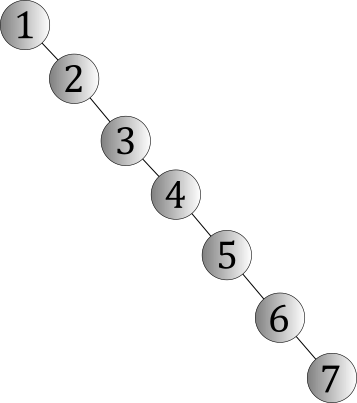
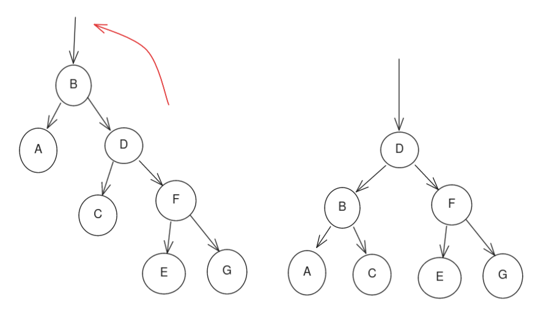
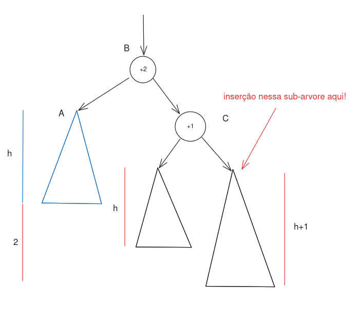
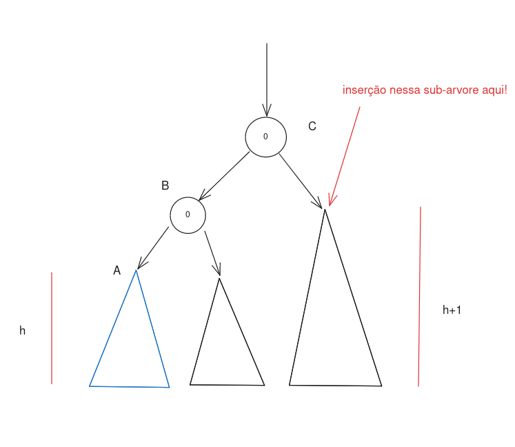
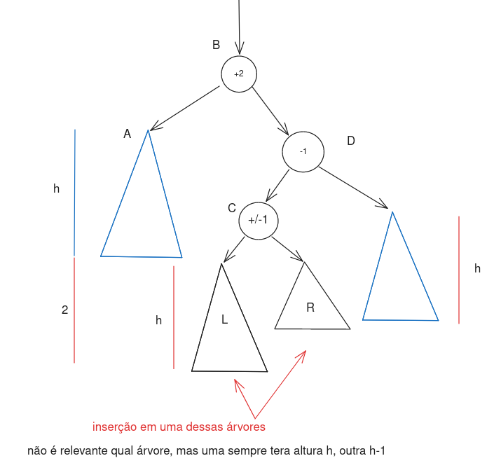
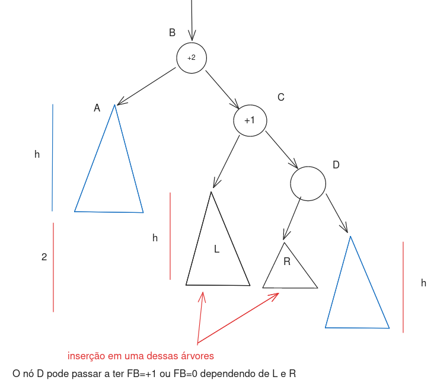
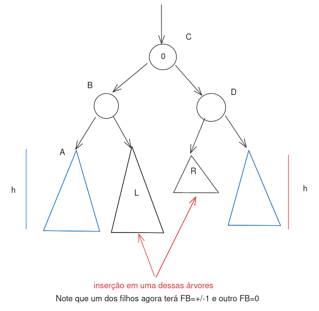
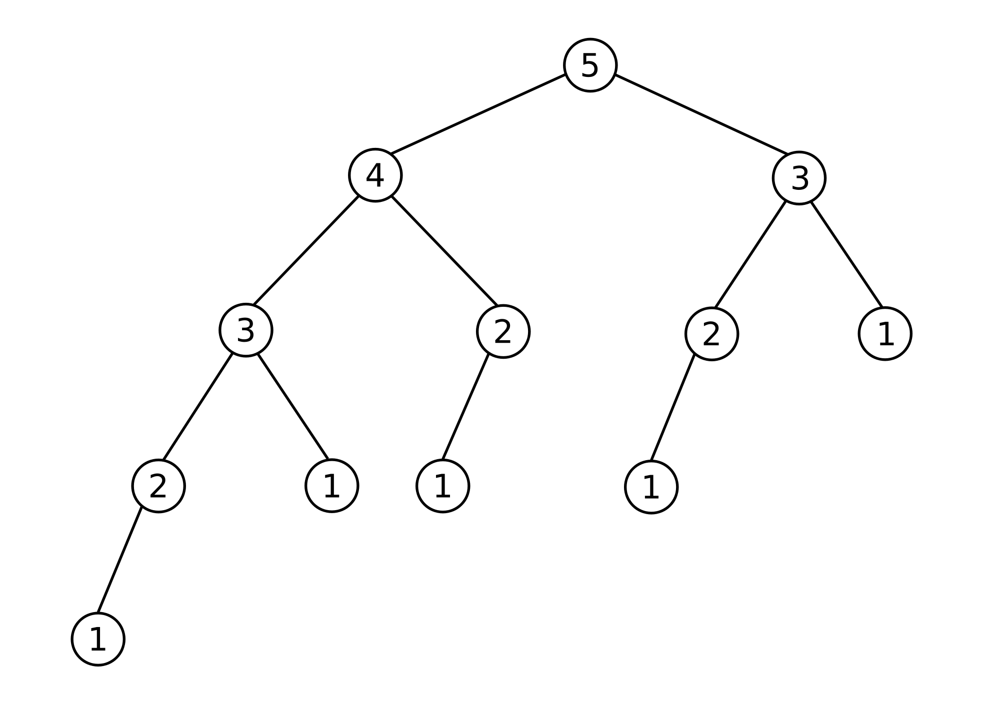

# Árvore AVL

A estrutura de dados Árvore Adelson-Velsky Landiis (AVL) é uma das primeiras estruturas que implementam uma **árvore balanceada de pesquisa**. 
Árvores balanceadas de pesquisa (ou auto-balanceantes) são relevantes por evitar o problema caminhos muito longos criados por inserções problemáticas.
No pior caso, uma árvore binária pode se tornar tão "degenerada" (ou seja, não parecendo uma árvore) que seja efetivamente uma lista, como vista na figura a seguir.




Nesses casos, teremos que embora o caso esperado de complexidade para busca binária em árvores seja $O(log{n})$, a complexidade do pior caso irá se tornar $O(n)$, equivalente
a uma busca sequêncial. Como em muitas aplicações podemos ter listas de chaves com inserções e remoções arbitrárias (como por exemplo a lista de número de matrículas válidos),
precisamos de uma estrutura que mantenha todas as 3 operações a seguir eficientes:

* Busca por um elemento pela sua chave
* Inserção de uma chave em ordem
* Remoção de uma chave

É para isso que serve uma árvore balanceada de pesquisa. Existem várias árvores diferentes que em alguns casos são equivalentes, como a Rubro-Negra (Red-Black).

## Definição da AVL

A árvore AVL se baseia apenas em uma propriedade simples, onde para todo nó $v$, sendo $h_1$ e $h_2$ as alturas das subárvores a sua esquerda e direita respectivamente:

$$
|h_2 - h_1| \leq 1
$$

Para isso é utilizado um atalho, onde, ao invés de recomputar a altura para cada nó após toda inserção ou remoção, é armazenado um valor intermediário chamado 
Fator de Balanceamento ($FB$). Como $|h_2 - h_1| = |FB| \leq 1$, temos que os únicos valores válidos para $FB$ em todos os nós serão $\{-1, 0, 1\}$. Casos algum nó 
se encontre com valores fora desse intervalo, a árvore está desbalanceada e precisa ser "corrigida." Essas correções serão dadas utilizando um método chamado "rotação."

## Inserção

A Inserção em uma árvore AVL se dá inicialmente de forma idêntica a em uma árvore binária genérica. Iniciando da raíz, checa se o valor da chave a inserir é 
menor ou maior que a chave do nó examinado, e repete a função respectivatemente para o nó esquerdo ou direito. Esse processo se repete até que se alcance um espaço "vázio" 
onde a nova chave vai ser inserida.

```python
# Pseudocódigo
func Insere(Nó nó, int chave:
  if chave < nó.chave:
    if (no.esquerdo):
      Insere(nó.esquerdo, chave)
    else:
      Cria(nó.esquerdo, chave)

  else:
    if (nó.direito):
      Insere(nó.direito, chave)
    else:
      Cria(nó.esquerdo, chave)
```

### Desbalanceamento


Na segunda étapa é verificado se árvore se tornou desbalanceada, e caso sim, é corrigida. Primeiro os fatores de balanceamento terão que ser atualizados. Por padrão, 
como o novo nó é uma folha, seu $FB$ será 0. Agora todo nó acima dele precisa ser atualizado de acordo com os fatores de balanceamento de seus filhos.

O nó imediatamente anterior ao nó inserido terá $\pm1$ adicionado ao seu $FB$, com o sinal definido pelo lado ao qual o novo vértice foi adicionado.
Caso o novo $FB$ agora seja zero, sabemos que não houve uma diferença na altura máxima, já que isso significa que a subárvore a partir desse nó se tornou 
balanceada, e podemos encerrar o algoritmo.

Caso esse novo $FB=\pm1$, sabemos que a altura dessa sub-árvore aumentou, e portanto, contiuamos propagando essa mudança pros nós acima da mesma forma ao parágrafo anterior.

Continuando esse procedimento eventualmente chegaremos à raíz com todos fatores de balanceamento válidos, no caso em que a árvore se manteve balanceada, ou propagaremos 
a mudança para algum nó que torne seu $FB=\pm2$. Nesse caso encontramos uma sub-árvore desbalanceada e precisamos rebalancear.

```python
# Pseudocódigo
func propaga(Nó nó, int lado): #lado = +/-1
  nó.FB += lado
  if nó.FB == 0:
    return
  else if nó.FB == +/-1:
    # houve mudança de altura, propaga
    if nó.chave < nó.pai.chave: #à esquerda
      propaga(nó.pai, -1)
    else: #à direita
      propaga(nó.pai, +1)

  else if nó.FB == +/-2:
    #veremos na seção a seguir
    rebalanceia(nó)

```


### Rebalanceamento

Para rebalancear a sub-árvore, a AVL tree aplica uma operação chamada de "rotação." Tomando como exemplo uma rotação simples para à esquerda, teremos uma transformação no sentido anti-horário, onde o nó que antes era o filho à direita "subirá" pra posição de seu pai, que se tornará seu filho à esquerda. Caso o nó que originalmente era o filho à direita já possua um filho á esquerda, esse filho junto com toda sua sub-árvore irá "descer" para se tornar o filho à direita do antigo pai. Segue uma imagem demonstrando essa operação, rotacionando no nó B para a esquerda. 



Note que ela também possui uma operação idêntica para a direita, seguindo o sentido horário. Note também que a árvore sempre continua ordenada mantendo a sua propriedade de árvore de busca, com elementos menores à esquerda, e maiores à direita.


Quando é encontrada uma sub-árvore desbalanceada (novamente, uma sub-árvore onde sua raíz tem $FB=\pm2$), teremos dois casos possíveis para cada direção. Tomando como direção de exemplo a direita, o primeiro caso é onde a sub-árvore está desbalanceada 
para a direita ($FB=+2$), e a inserção que desbalanceou a árvore aconteceu na sub-árvore à direita **do seu filho também à direita**. Para avaliar se isso aconteceu, basta verificar se o $FB$ do filho apropriado tem o mesmo sinal do 
nosso nó desbalanceado. No nosso exemplo, teremo que $FB=+2$ para a raíz e $FB=+1$ para o filho à direita. 
O mesmo valería para $FB=-2$ para a raíz e $FB=-1$ para o filho à esquerda.



Nesse caso, para rebalancear a árvore, basta realizar uma rotação simples para a direção oposta (nesse caso, esquerda). Note que os únicos valores de $FB$ que irão mudar são os do nó rotacionado e seu filho à direita, ambos para zero, o que é não é implementado no pseudocódigo por conveniência.



Segue um pseudocódigo que implementa uma rotação para a esquerda. Note que também será necessário uma função para a
rotação para a direita, mas essa é idêntica, apenas trocando as direções. 

```python
# Pseudocódigo
func rotacao_para_esquerda(Nó nó):
  filho_direita = nó.direita
  neto_direita_esquerda = filho_direita.esquerda
  pai = nó.pai

  nó.direita = neto_direita_esquerda
  filho_direita.esquerda = nó
  # checa lado onde árvore se encontra em relação ao pai
  if nó.chave < pai.chave: #esquerda
    pai.esquerda = filho_direita
  else: #direita
    pai.direita = filho_direita

```

#### Rotação dupla

Já o segundo caso, teremos a situação oposta, onde (tomando como exemplo novamente desbalanceamento para a direita) 
teremos um $FB=+2$, mas o filho apropriado tem sinal oposto ($FB=-1$), ou seja, o nó novo foi inserido na sua 
sub-árvore à esquerda. Isso se refere ao caso descrito na imagem a seguir:



Nesse caso precisamos fazer duas rotações (em alguns materiais chamada de "Rotação Dupla" ou até "Rotação LR/RL").

Primeiro precisamos rotacionar a sub-árvore do filho relevante, utilizando a mesma função descrita no passo anterior, na 
direção do desbalanceamento. 
No nosso exemplo, esse será o filho à direita que será rotacionado, dessa vez para a direita.



Após essa operação, a árvore se encontra a um estado equivalente ao do primeiro caso, com desbalanceamento para a direita,
e com o filho a direita com $FB$ com o mesmo sinal que seu pai. Portanto podemos agora aplicar uma rotação para a esquerda 
de forma idêntica ao caso 1.




Podemos então formular o pseudocódigo para a rotação dupla. Assim como no caso anterior, note que ela terá também uma 
equivalente "esquerda_direita".

Note que o valor do $FB$ do novo neto mais à direita vai ser $+1$ se o seu antigo filho à esqueda tinha $FB=-1$, e $-1$ caso seu antigo pai tivesse $FB=+1$. A simétrica disso é verdade no caso da rotação esquerda-direita. Exceto esses dois, todos os outros $FB$s se mantêm os mesmos. Esse detalhe de implementação não está incluso no pseudocódigo para manter a simplicidade.


```python
func rotacao_direita_esquerda(Nó nó):
  rotacao_para_direita(nó.direita)
  rotacao_para_esquerda(nó)
```

E por fim a função que aplica o rebalanceamento total, a partir do nó encontrado na função "propaga" na seção anterior.

```python
func rebalanceia(Nó nó):
  if nó.FB == -2: #esquerda
    if nó.esquerda.FB == -1: #esquerda-esquerda
      rotacao_para_direita(nó)
    else: #esquerda-direita
      rotacao_esquerda_direita(nó)
  else: #direita
    if nó.direita.FB == +1: #direita-direita
      rotacao_para_esquerda(nó)
    else: #direita-esquerda
      rotacao_direita_esquerda(nó)
```

### Algumas considerações

Uma dúvida comum entre os alunos é sobre quantas operações de rotação são necessárias por inserção. A resposta é sempre: 
"no máximo uma, simples ou dupla." A prova intuitiva disso é de que ao inserir um novo nó na árvore, para cada ancestral 
desse nó, apenas uma de suas sub-árvores aumenta de tamanho, causando um possível desbalanceamento. O primeiro nó encontrado 
pela função "propaga" terá necessariamente antes da inserção duas sub-árvores filhas com alturas $h$ e $h+1$, onde a inserção na 
maior causará o desbalanceamento com $h$ e $h+2$.

Mas dado que uma operação de rotação é feita, que corrige duas sub-árvores filhas com altura $h$ e $h+2$ para agora duas com
altura $h+1$, temos que a altura de toda essa sub-árvore pai que contém as duas irá voltar a ter exatamente a mesma 
altura de antes. Presumindo que a árvore toda já estava balanceada antes, isso significa que ela toda estará balanceada agora, 
e mais rotações não serão necessárias.

Note que mesmo que fosse continuada a propagação, não haveria efeito, já que ela para quando o primeiro nó é encontrado com $FB=0$, que é sempre o caso da raíz da sub-árvore rotacionada.

Outra confusão comum é sobre a aparência de uma árvore balanceada. A propriedade de balanceamento não significa que ela é uma
árvore completa ou ótima. Quando se fala da "altura" de uma árvore, se refere ao tamanho do caminho **máximo** de um nó até as folhas e garante que entre dois filhos, eles terão no máximo diferença de $\pm1$. 

Isso não leva em consideração o caminho **minimo**, que podem ser bem diferentes. A árvore que considera os caminhos mínimos é 
chamada "Árvore Ótima" e está fora do escopo da disciplina. Para ilustrar isso, segue uma ilustração do pior caso de uma 
árvore AVL, chamada de "Árvore de Fibonacci". Note o como mesmo com seu formato aparentemente ineficiente, ela ainda segue 
a definição de balanceamento na primeira seção, e seu pior caso de busca ainda é $O(log{n})$.




### Bibliografia


Esse material foi quase unicamente escrito utilizando o livro "The Art of Computer Programming" do Donald Knuth, especialmente o Volume 3, seção 6.2.3.
